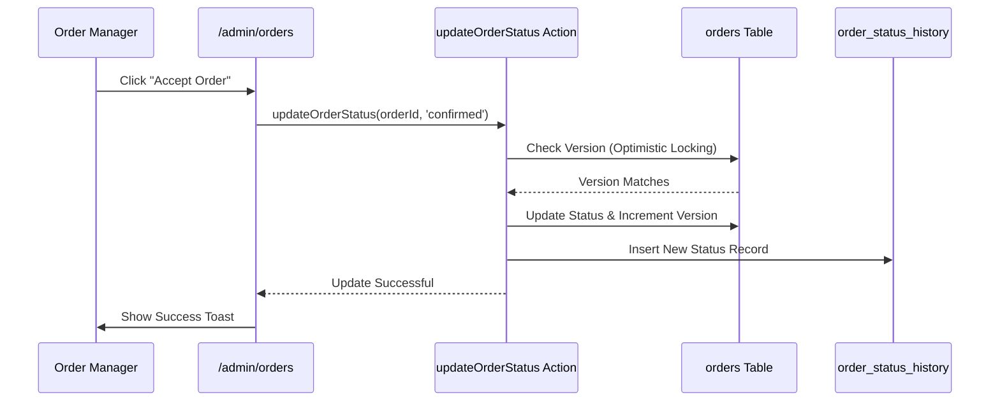

# توثيق لوحة الإدارة — مشروع بيت المندي

## 1. نظرة عامة
تعتبر لوحة الإدارة (Admin Dashboard) النظام الخلفي لإدارة عمليات المطعم. مبنية بالكامل باستخدام مكونات React Client Components وتتواصل مع Server Actions لإنجاز العمليات وتحديث الواجهة مباشرة.

---

## 2. الصفحات والوظائف الرئيسية

### `/admin` (لوحة القياس الرئيسية - Dashboard)
- **الغرض:** تقديم نظرة عامة سريعة على أداء اليوم.
- **الوظائف:**
  - عرض إجمالي مبيعات اليوم، وعدد الطلبات، والعملاء النشطين.
  - الرسوم البيانية لأداء المبيعات.
  - إشعارات بالطلبات المعلقة التي تتطلب اتخاذ إجراء.

### `/admin/orders` (إدارة الطلبات)
- **الغرض:** معالجة الطلبات الواردة وتحديث حالاتها.
- **الوظائف:**
  - عرض جدول تفاعلي للطلبات مصنف حسب الحالة (معلق، قيد التحضير، في الطريق، ...).
  - تحديث حالة الطلب بضغطة زر.
  - عرض تفاصيل الفاتورة ومسار التوصيل.
  - *ملاحظة:* هذه هي الصفحة الوحيدة المتاحة لحسابات `order_manager`.

### `/admin/menu` و `/admin/categories` (إدارة القائمة)
- **الغرض:** التحكم بالمنتجات المعروضة في الموقع والتطبيق.
- **الوظائف:**
  - إضافة، وتعديل، وحذف الأصناف (Soft Delete للطلبات المرتبطة).
  - إدارة التصنيفات وتحديد الأيقونات والصور.
  - تحديد الأحجام المتوفرة وتسعير كل حجم بشكل مستقل (`item_prices`).

### `/admin/offers` (إدارة العروض)
- **الغرض:** إنشاء حزم تسويقية وتخفيضات.
- **الوظائف:**
  - إنشاء عروض خصم نسبة، خصم مبلغ ثابت، وسعر للحزمة.
  - تحديد الأصناف المشمولة في العرض والكميات.
  - تحديد فترة صلاحية العرض (بداية ونهاية).

### `/admin/reviews` (إدارة التقييمات)
- **الغرض:** مراقبة جودة الخدمة.
- **الوظائف:**
  - عرض التقييمات الواردة من العملاء.
  - قبول/إخفاء التقييمات.
  - تحديد التقييمات المميزة لتظهر في الصفحة الرئيسية.

### `/admin/delivery` (نظام التوصيل)
- **الغرض:** التحكم المالي بآلية حساب التوصيل.
- **الوظائف:**
  - تحديد الرسوم الأساسية والمسافة المجانية ومقابل الكيلومتر الإضافي.
  - تفعيل رسوم الذروة ورسوم سوء الأحوال الجوية.
  - تحديد النطاق الأقصى المسموح لخدمة التوصيل.

### `/admin/gallery` (معرض الصور)
- **الغرض:** إدارة الهوية البصرية.
- **الوظائف:** رفع الصور لتظهر للعملاء في قسم المعرض المخصص.

### `/admin/settings` و `/admin/reports`
- سيتم التطرق لهما بالتفصيل في تقارير منفصلة.

---

## 3. تدفق تحديث حالة الطلب

---

## 4. الحماية والتأمين

- كل المكونات محاطة بـ `Layout` يمنع غير المصرح لهم من الرؤية (Client-Side Protection).
- مدعومة بـ `Middleware` يمنع الوصول للصفحات والـ APIs (Edge Protection).
- محصنة على مستوى `RLS` يمنع استرجاع البيانات بدون Role صحيح (Database Protection).
