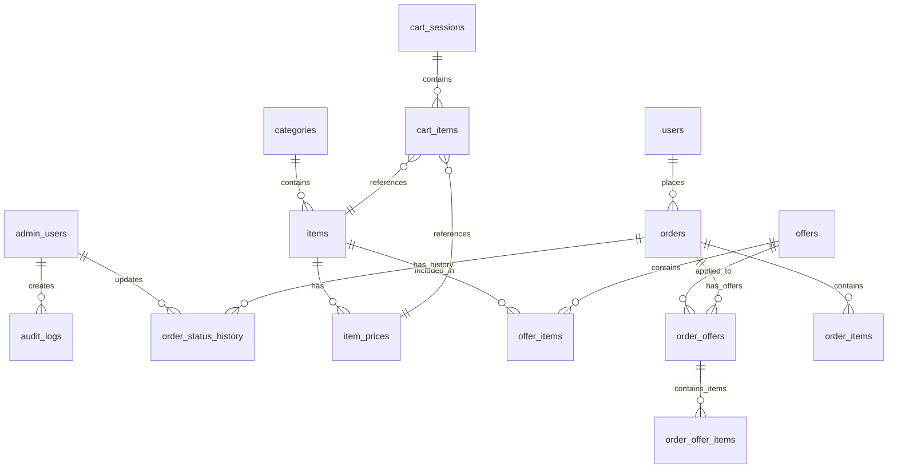

# توثيق قاعدة البيانات — مشروع بيت المندي

## 1. نظرة عامة على قاعدة البيانات

يعتمد النظام على **PostgreSQL** المستضافة في **Supabase**، وتدار بالكامل عبر **Drizzle ORM**.
تتكون القاعدة من 19 جدولاً مرتبطاً بعلاقات قوية ومحمياً بـ Row Level Security (RLS).

---

## 2. المخطط الكياني العلائقي (ERD Diagram)

---

## 3. تفاصيل الجداول

### 3.1. جداول المستخدمين والصلاحيات
| اسم الجدول | الغرض | العلاقات | مستخدم بواسطة |
|------------|-------|----------|---------------|
| `users` | بيانات العملاء الأساسية | `orders` | تسجيل الطلبات وحفظ العناوين |
| `admin_users` | حسابات الإدارة وصلاحياتهم | `audit_logs`, `order_status_history` | لوحة الإدارة وتسجيل الحركات |

### 3.2. جداول القائمة والمنتجات
| اسم الجدول | الغرض | العلاقات | مستخدم بواسطة |
|------------|-------|----------|---------------|
| `categories` | تصنيفات الأطباق | `items` | صفحات القائمة والإدارة |
| `items` | الأطباق والمنتجات | `categories`, `item_prices` | القائمة، السلة، العروض |
| `item_prices` | أسعار الأصناف حسب الحجم | `items`, `cart_items` | محرك الأسعار |

### 3.3. جداول العروض
| اسم الجدول | الغرض | العلاقات | مستخدم بواسطة |
|------------|-------|----------|---------------|
| `offers` | العروض والتخفيضات النشطة | `offer_items` | صفحة العروض والسلة |
| `offer_items` | الأصناف المكونة للعرض | `offers`, `items`, `item_prices` | محرك أسعار العروض |

### 3.4. جداول السلة (المؤقتة)
| اسم الجدول | الغرض | العلاقات | مستخدم بواسطة |
|------------|-------|----------|---------------|
| `cart_sessions` | جلسات التسوق المؤقتة | `cart_items` | عربة التسوق |
| `cart_items` | محتويات عربة التسوق | `cart_sessions`, `items` | عربة التسوق |

### 3.5. جداول الطلبات الرئيسية
| اسم الجدول | الغرض | العلاقات | مستخدم بواسطة |
|------------|-------|----------|---------------|
| `order_sequences` | ترقيم الطلبات (BAM-DATE-XXXX) | مستقل | عملية إنشاء الطلب |
| `orders` | البيانات الرئيسية للطلب | `users`, `order_items`, `order_offers` | لوحة الإدارة والمستخدم |
| `order_items` | الأصناف المطلوبة (سعر ثابت) | `orders` | تفاصيل الطلب والفواتير |
| `order_offers` | العروض المطبقة على الطلب | `orders`, `offers` | تفاصيل الطلب والفواتير |
| `order_offer_items` | أصناف العرض المباعة | `order_offers` | الفواتير والمخزون |
| `order_status_history` | سجل تغير حالات الطلب | `orders`, `admin_users` | تتبع الطلبات والإدارة |

### 3.6. جداول التتبع وإدارة النظام
| اسم الجدول | الغرض | العلاقات | مستخدم بواسطة |
|------------|-------|----------|---------------|
| `customer_tokens` | أرقام تتبع الطلبات المستقلة | مستقل | نظام التتبع بدون تسجيل |
| `gallery_images` | صور معرض المطعم | مستقل | صفحة المعرض والإدارة |
| `reviews` | تقييمات العملاء | مستقل | الصفحة الرئيسية والإدارة |
| `site_settings` | إعدادات النظام (JSON) | مستقل | التوصيل والأسعار والموقع |
| `branches` | فروع المطعم | مستقل | صفحة التواصل |
| `audit_logs` | سجل حركات الإدارة | `admin_users` | التقارير الأمان |
| `scheduled_reports`| إعدادات التقارير المجدولة | مستقل | Cron Jobs |

---

## 4. المفاتيح والقيود (Constraints & Indexes)

1. **الترقيم التسلسلي (Order Sequences):**
   - يستخدم قيد `sequence_date` كـ `UNIQUE` لضمان عدم تكرار الترقيم في نفس اليوم.
   - يعتمد على عملية `UPSERT` ذرية (Atomic) لضمان التزامن.

2. **الأسعار (Prices):**
   - نوع البيانات `numeric` يُستخدم في كل المبالغ المالية لمنع أخطاء التقريب الناتجة عن أنواع الفاصلة العائمة (`float`).

3. **الحذف الآمن (Soft Deletes):**
   - الجداول الحساسة (مثل `orders`) تحتوي على أعمدة `is_deleted` و `deleted_at` ولا يتم حذف بياناتها فعلياً، بل تُخفى في واجهات القراءة.

4. **المعرفات (UUIDs):**
   - جميع الجداول (باستثناء `customer_tokens`) تستخدم `UUIDv4` العشوائي لتوفير أمان إضافي ضد تخمين المعرفات.

---

## 5. النسخ الاحتياطية للسجلات (Snapshots)

يعتمد تصميم قاعدة البيانات على نمط "Snapshotting" في الطلبات:
- يتم أخذ نسخة من **الأسعار** و**الأسماء** للأصناف وحفظها في `order_items` و `order_offers`.
- هذا يضمن أن تعديل اسم أو سعر منتج في المستقبل **لا** يغير الفواتير التاريخية القديمة.
