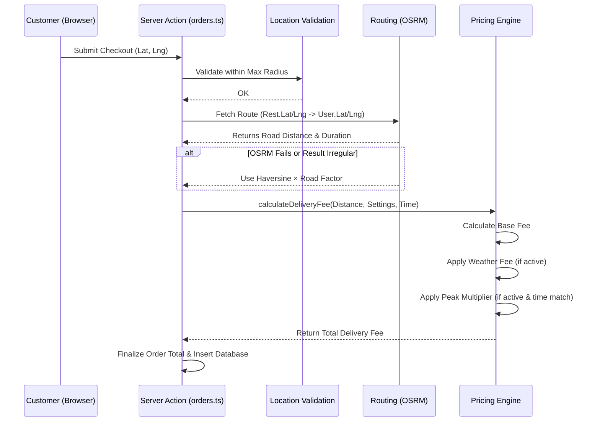

# توثيق نظام التوصيل — مشروع بيت المندي

## 1. نظرة عامة

يمتلك مشروع بيت المندي نظام حساب توصيل معقد (Dynamic Delivery Pricing) يستند إلى الموقع الجغرافي للمطعم والعميل، ويستخدم نظام التوجيه (Routing) الفعلي للمركبات مع طبقات من الرسوم المتغيرة حسب ظروف الوقت والطقس.

---

## 2. منطق حساب المسافة (Distance Calculation)

يقوم النظام بحساب المسافة باستخدام نهجين متوازيين:

1. **المسار الفعلي (OSRM Routing):** 
   - يستخدم خدمة `router.project-osrm.org` المجانية.
   - يعيد المسافة الفعلية بالسيارة (Road Distance) والوقت المقدر (Duration).
   - يتم حماية الاستدعاء بوقت أقصى (Timeout) مقداره 8 ثوان.

2. **الخط المستقيم (Haversine Formula):**
   - يُستخدم للتحقق (Validation) وكخطة بديلة (Fallback) إذا تعطل OSRM.
   - يتم احتساب المسافة الجغرافية المستقيمة، وتُضرب في معامل طريق `road_factor` (افتراضياً 1.5) لتقدير مسافة الطريق الفعلية.
   - *سبب التحقق:* منع أي تلاعب يرسل إحداثيات خاطئة تجعل OSRM يُنتج مساراً غير منطقي.

---

## 3. محرك حساب الرسوم (Delivery Pricing Engine)

يوجد محرك تسعير وحيد (Single Source of Truth) موجود في `src/lib/delivery-pricing.ts`. لا يثق النظام أبداً برسوم التوصيل المرسلة من العميل بل يعيد حسابها في الخادم.

### معادلة حساب الرسوم الأساسية:
- إذا كانت `Distance` ≤ `IncludedDistance` (المسافة المشمولة):
  - الرسوم = `BaseFee` (الرسوم الأساسية).
- إذا كانت `Distance` > `IncludedDistance`:
  - الرسوم = `BaseFee` + ((`Distance` - `IncludedDistance`) × `ExtraFeePerKm` (رسوم الكيلومتر الإضافي)).

### الحدود القصوى:
- النظام يرفض أي طلب تتجاوز مسافته الـ `MaxDeliveryDistance` (حد نطاق التوصيل).

---

## 4. الرسوم الإضافية (Surcharges)

يشتمل المحرك على رسوم ديناميكية:

1. **رسوم الطقس (Weather Fee):**
   - يمكن تفعيلها من لوحة الإعدادات.
   - إذا فُعّلت، يضاف مبلغ ثابت مقطوع لإجمالي رسوم التوصيل لتعويض المناديب أثناء سوء الأحوال الجوية.

2. **رسوم أوقات الذروة (Peak Hours Fee):**
   - يتم تحديد أوقات بداية ونهاية الذروة وأيام محددة (مثل الخميس والجمعة).
   - تحسب كنسبة مئوية (Percentage) من **الرسوم الأساسية** فقط (وليس الإجمالي).
   - النظام يتحقق من وقت الطلب الحالي في خادم الإنتاج مقارنة بنطاق الذروة.

---

## 5. حدود التوصيل في صنعاء (Location Validation)

بالإضافة للمسافة، يحتوي ملف `src/lib/location-validation.ts` على تقريب لمضلع الحدود الجغرافية لمدينة صنعاء باستخدام خوارزمية (Ray-Casting Algorithm).
- يُستخدم هذا لضمان أن النطاق يقع فعلياً داخل العاصمة ولا يقبل إحداثيات عشوائية أو بعيدة غير مخدومة.

---

## 6. مخطط تدفق احتساب التوصيل (Delivery Calculation Flow)

