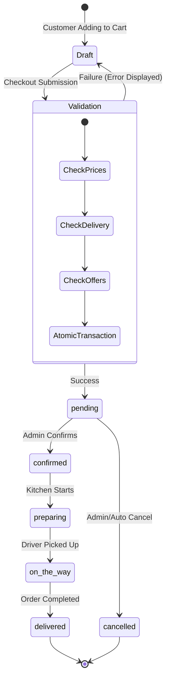

# توثيق دورة حياة الطلبات — مشروع بيت المندي

## 1. نظرة عامة على نظام الطلبات

يعد نظام الطلبات في مشروع بيت المندي هو القلب النابض للتطبيق. يعتمد النظام على معمارية ذرية (Atomic Transactions) لمعالجة البيانات، ويعتمد على الخادم حصرياً (Server-Side) لحساب التكاليف لضمان منع الاحتيال أو التلاعب بالأسعار.

---

## 2. دورة حياة الطلب (Order Lifecycle)

---

## 3. محرك الأسعار المركزي (Pricing Engine)

النظام لا يعتمد مطلقاً على حسابات الأسعار المرسلة من جهة العميل (المتصفح). يتم إرسال "المعرفات" والكميات فقط.

**ملف: `src/lib/pricing-engine.ts`**
- يقبل المدخلات ويعالج الحالات غير المتوقعة (`NaN`, `null`, `undefined`) عبر دالة `safeNumber`.
- يعيد حساب الإجمالي (Subtotal) بناءً على سعر المنتج في قاعدة البيانات.
- يدمج رسوم التوصيل، الضرائب، والخصومات لإنتاج `totalAmount`.
- يتم استخدام الدالة `calculateOrderTotals` في الواجهة الخلفية فقط (Server Actions).

---

## 4. ترقيم الطلبات (Order Number Generation)

يتم إنتاج رقم تسلسلي للطلب بصيغة `BAM-YYYYMMDD-XXXX` ليكون سهل القراءة للعملاء وممثلاً لتاريخ اليوم.
العملية تعتمد على:
1. الإقفال المتبادل (Concurrency Control).
2. عملية `UPSERT` متكررة على جدول `order_sequences` لحجز الرقم التالي (Sequence Allocation).
3. آلية تكرار (Retry Mechanism) تصل لـ 10 محاولات في حالة الصدام، مع خطة بديلة (UUID Fallback) في حالة فشل التسلسل.

---

## 5. الحفظ باستخدام Transactions (Drizzle)

عملية حفظ الطلب داخل `src/actions/orders.ts` مجمعة في Transaction واحد، تشمل:
1. التحقق من الأسعار والحد الأدنى للطلب ورسوم التوصيل.
2. إنشاء توكن التتبع (Tracking Token) في `customer_tokens` (للزوار).
3. **Insert Orders:** إنشاء السجل الرئيسي في جدول `orders`.
4. **Insert Items:** تسجيل الأصناف بأسعارها وقت الشراء في `order_items` (Snapshot).
5. **Insert History:** تسجيل الحالة الافتتاحية في `order_status_history`.
6. **Insert Offers:** (اختياري) تفكيك العروض وحزم المنتجات إلى عناصر وحفظها في `order_offers` و `order_offer_items`.

إذا فشلت أي خطوة من هذه الخطوات، يتم التراجع عن (Rollback) كافة الخطوات السابقة، مما يمنع مشكلة "البيانات اليتيمة" (Orphan Data).

---

## 6. التعامل مع العروض داخل الطلب (Offers Processing)

عند تقديم عرض (Bundle أو Discount)، يتم معالجته بواسطة `src/lib/offer-pricing.ts`.
- يتم حساب قيمة التخفيض بدقة (سواء كان مبلغاً ثابتاً، أو نسبة، أو عنصراً مجانياً).
- يتم تقسيم الإجمالي المخفض وتوزيعه ليحسب في إجمالي الفاتورة بطريقة آمنة.
- يتم أخذ "لقطة" (Snapshot) لمحتوى العرض في وقت الطلب حتى لا يتأثر لو تغير محتوى العرض لاحقاً.

---

## 7. التتبع بدون تسجيل دخول (Guest Tracking)

النظام يسمح للمستخدم بالطلب دون الحاجة لإنشاء حساب (Guest Checkout).
- يتم إنشاء رمز سري عشوائي (Tracking Token).
- يُربط الرمز برقم هاتف العميل عبر جدول `customer_tokens`.
- يستخدم العميل الرابط `/track-order/[orderId]` ورقم الهاتف لعرض حالة الطلب المباشرة.
- يستفيد النظام من **Supabase Realtime** لتحديث صفحة التتبع لدى العميل فور قيام الإدارة بتغيير الحالة دون الحاجة لإعادة تحميل الصفحة.
