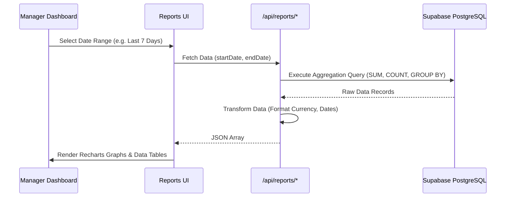

# توثيق نظام التقارير — مشروع بيت المندي

## 1. نظرة عامة
تم بناء نظام التقارير كطبقة تحليلية متقدمة تهدف إلى تقديم رؤى تجارية دقيقة لاتخاذ القرارات. يعتمد النظام على معالجة البيانات من خادم قاعدة البيانات وتنسيقها للواجهة الأمامية باستخدام Rcharts للتصور البصري.

---

## 2. معمارية التقارير (Reports Architecture)

تم فصل التقارير إلى APIs مستقلة لضمان سرعة الاستجابة ومنع اختناق الخادم (Server Bottlenecks).

### مسارات التقارير (API Routes):
- `/api/reports/dashboard`: ملخص الأداء اليومي.
- `/api/reports/sales`: تقارير المبيعات مع فلترة حسب الفترة.
- `/api/reports/orders`: تحليلات حالات الطلب والفترات الزمنية.
- `/api/reports/products`: إحصائيات المنتجات الأكثر والأقل مبيعاً.
- `/api/reports/customers`: بيانات العملاء الدائمين وحجم إنفاقهم.
- `/api/reports/delivery-analytics`: تحليل مسافات التوصيل ورسومه.

---

## 3. تدفق البيانات للتقارير (Data Flow)

---

## 4. أدوات التصدير والطباعة

يتيح النظام للإدارة إمكانية تصدير البيانات للاستخدام خارج المنصة:

1. **تصدير إلى Excel (`lib/exportExcel.ts`):**
   - يستخدم مكتبة `exceljs` لبناء جداول مخصصة.
   - يدعم تصدير تقارير المبيعات، الطلبات، المنتجات.
   - ينسق الأعمدة بشكل متوافق مع اللغة العربية (RTL).

2. **طباعة الفواتير والتقارير (`lib/printReport.ts`):**
   - يستخدم مزيجاً من `html2canvas` و `jsPDF` لتوليد ملفات PDF دقيقة.
   - يستخدم لطباعة فواتير الطلبات بشكل احترافي يحتوي على شعار المطعم، كود QR للتتبع، وتفاصيل الحساب.

---

## 5. ميزات الأداء (Performance Handling)

بسبب كثافة العمليات الحسابية في التقارير (Aggregation):
- يتم تنفيذ جميع حسابات التجميع (SUM, COUNT) على مستوى قاعدة البيانات PostgreSQL لتقليل حجم الذاكرة المستهلك في خادم Next.js.
- يتم تجاهل الطلبات المحذوفة (`is_deleted=true`) والمرفوضة في حسابات الأرباح لمنع تشوه البيانات.
