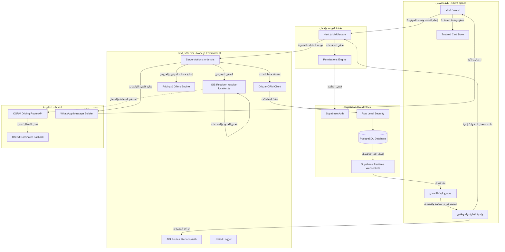

# وثيقة المواصفات الفنية ومعمارية النظام (System Architecture & Technical Specification)
## مشروع منصة "بيت المندي" (Bait Al Mandi Web Application)
### مطور من قبل: شركة إسناد التقنية (Esnaad Tech)

---

## 🧭 1. Executive Overview (نظرة عامة تنفيذية)

### وصف عالي المستوى للنظام (High-Level System Description)
نظام **بيت المندي** هو نظام برمجيات متكامل (Enterprise Web Platform) مخصص لإدارة وتسهيل عمليات الطلب، التوصيل، الفوترة، وإعداد التقارير لمطعم "بيت المندي". يجمع النظام بين واجهة عامة سلسة وتفاعلية للزبائن تتيح لهم تصفح قائمة الأطباق والعروض والباقات وإرسال الطلبات، وبين لوحة تحكم إدارية متكاملة ومؤمنة بالكامل تعتمد على الصلاحيات والأدوار (Role-Based Access Control) لإدارة المبيعات والتوصيل وتتبع العمليات لحظياً.

### الهدف التجاري (Business Objective)
1. **تحسين تجربة طلب الطعام**: تسهيل وصول العملاء لقائمة الطعام وحساب أسعار الباقات والعروض بدقة لزيادة معدل التحويل والمبيعات.
2. **أتمتة وحوكمة التوصيل**: توفير آلية آلية دقيقة لحساب رسوم التوصيل بناءً على مسارات حركية وجغرافية واقعية لتجنب خسائر التقديرات العشوائية.
3. **التحكم التشغيلي الكامل**: تمكين الطاقم الإداري والتشغيلي من معالجة الطلبات وإصدار الفواتير وتحليل الأداء التجاري بشكل فوري.

### المشكلة التي يحلها النظام (The Problem Statement)
1. **أزمة العنونة والخرائط في اليمن (صنعاء)**: تعاني خدمات التوصيل من صعوبة تحديد العناوين بدقة بسبب غياب العنونة المنظمة، وهو ما يحله النظام عبر دمج محرك جيومكاني محلي (Sana'a Boundaries Engine) مع خرائط مفتوحة المصدر لفك تشفير النطاقات الجغرافية وتقدير مسافة القيادة الفعلية.
2. **التلاعب بالأسعار ورسوم التوصيل (Client-Side Tampering)**: كانت الأنظمة التقليدية تعتمد على حساب القيم المالية في المتصفح مما يتيح التلاعب بها؛ ويحل هذا النظام المشكلة عبر **محرك تسعير خادمي صارم** يعيد حساب السلة ورسوم التوصيل والخصومات بشكل كامل قبل إدراج الطلب.
3. **فشل العمليات والبيانات اليتيمة (Orphan Records)**: تؤدي انقطاعات الاتصال أو فشل إدراج بعض عناصر السلة إلى وجود فواتير فارغة؛ ويحل هذا النظام المشكلة عبر **العمليات الذرية المتكاملة (Atomic Database Transactions)** في قاعدة البيانات.

### نطاق النظام (System Scope)
* **نظام الطلبات العام (Public Ordering System)**: تصفح القائمة، السلة المتكاملة، حساب رسوم التوصيل الديناميكية بناءً على تحديد الموقع الجغرافي، وإرسال الفاتورة آلياً عبر الواتساب مع رابط تتبع مشفر.
* **نظام إدارة وتتبع الطلبات (Admin Orders Workflow)**: استقبال الطلبات لحظياً وبث التحديثات، مع معالجة الحالات (تأكيد، تحضير، توصيل، إلغاء) بدقة عبر التحديث اللحظي وقفل البيانات المتزامن.
* **نظام التقارير والتحليلات (Reports & Analytics)**: تحليل المبيعات، ومقارنة الفترات الزمنية ومعدلات النمو، وتحديد فترات الذروة، وإحصائيات المنتجات والعملاء والأفواج الجغرافية.
* **نظام الفوترة والمطابقة (Billing & Invoices)**: توليد فواتير حرارية (Customer Receipts) احترافية جاهزة للطباعة مع كود QR مدمج لتتبع الطلب، وتوليد جداول إكسل للمطابقات المالية.

### الفئات المستهدفة والصلاحيات (Users & Roles)
1. **العميل / الزائر (Guest / Customer)**: مستخدم للواجهة العامة، يمكنه إنشاء سلة، تحديد موقعه، إتمام الطلب وتتبعه عبر رابط فريد UUID دون الحاجة لحساب مسجل.
2. **مدير الطلبات (Order Manager)**: حساب إداري مقيد بصلاحيات تشغيلية فقط، مسموح له بالوصول لصفحة الطلبات والتحكم بحالاتها وتوليد فواتيرها، ويُمنع من الاطلاع على التقارير المالية أو الإعدادات أو تعديل المنتجات.
3. **المدير العام / المسؤول (Admin / Manager)**: حساب إداري ذو صلاحيات كاملة، يمتلك حق الوصول للتقارير والإعدادات وإدارة وتعديل الفروع والأصناف وتوليد التقارير.
4. **المطور (Developer)**: أعلى مستوى وصول للنظام للتحكم في الإعدادات المتقدمة وصيانة العمليات التقنية.

---

## 🏗 2. System Architecture (High-Level Design)

يعتمد نظام بيت المندي على معمارية **Monolith هجينة (Hybrid Monolith)** مدعومة بـ Backend-as-a-Service (BaaS) تقدمها منصة Supabase. يتم تطوير النظام بالكامل باستخدام إطار عمل Next.js 14 بميزاته الحديثة (App Router).

### تدفق البيانات الشامل (End-to-End Data Flow)
```
[الزبون: متصفح عميل] ──(Server Action: createOrder)──> [Next.js خادم التطبيق]
                                                               │
                                                               ├─> (حساب المسافة والرسوم) ─> [محرك الجغرافيا + OSRM]
                                                               ├─> (حساب الأسعار والعروض) ─> [Pricing Engine]
                                                               │
                                                               └──(Drizzle Transaction)──> [قاعدة بيانات PostgreSQL]
                                                                                               │
                                                                                       (Supabase Realtime)
                                                                                               │
                                                                                               ▼
                                                                                   [لوحة الإدارة: تتبع فوري]
```

### المكونات الأساسية للنظام (Core Components)

1. **طبقة العرض والعميل (Frontend Client)**:
   * مبنية على مكتبة React المدمجة في Next.js.
   * إدارة السلة المؤقتة عبر مخزن **Zustand Client State** مع تفعيل الحفظ التلقائي في الـ Local Storage.
   * واجهات خرائط تفاعلية لتحديد موقع التوصيل على خرائط OpenStreetMap ومطابقتها محلياً.

2. **خادم التطبيق والخلفية (Backend Server)**:
   * يعتمد على Next.js Server Actions كطبقة استدعاء آمنة وخلفية للعمليات المؤثرة (Mutative Operations) مثل إنشاء الطلبات وتحديث حالاتها.
   * استخدام Route Handlers (APIs) لعمليات الاستعلام المتكررة واستخراج البيانات (مثل تصدير ملفات إكسل والتقارير والتحقق الجغرافي).
   * تطبيق حماية صارمة عبر Middleware للتحقق من هوية وأدوار المستخدمين الإداريين.

3. **طبقة البيانات والخدمات السحابية (Database & BaaS Layer)**:
   * **PostgreSQL Database**: مستضافة على Supabase وتحتوي على البنية الهيكلية الكاملة.
   * **Supabase Auth**: مزود التوثيق الأمني وإدارة الجلسات للمستخدمين الإداريين.
   * **Supabase Realtime Engine**: محرك بث فوري يعتمد على بروتوكول WebSockets، يتيح للوحة الإدارة الاستماع لأي عمليات إدراج أو تحديث على جدول `orders` لتحديث الواجهة تلقائياً وبشكل فوري دون الحاجة لعمليات التكرار (Polling).
   * **Drizzle ORM**: محرك الاستعلام وتخطيط الجداول (ORM) المستخدم في السيرفر، والذي يدير الاتصال المباشر بقاعدة البيانات لتنفيذ العمليات والعمليات الذرية المعقدة (Transactions).

4. **الخدمات الجغرافية ومحرك المسارات (GIS & Routing Services)**:
   * **Local GIS Resolver**: محرك محلي يستند إلى خوارزميات Turf.js وفهارس B-Tree الممثلة في مكتبة RBush Spatial Index، يقوم بفحص إحداثيات الزبون ومطابقتها بمضلعات حدود مديريات صنعاء المخزنة في ملف GeoJSON محلي.
   * **OSRM Driving API**: محرك خارجي مفتوح لحساب مسارات القيادة الفعلية وتقدير مسافة القيادة وحساب زمن الرحلة الفعلي.

### نمط التواصل (Communication Protocol)
* **Server Actions**: تواصل ثنائي الاتجاه مشفر وتلقائي بين واجهة العميل والسيرفر لتمرير الأوامر الحركية.
* **REST API**: مسارات معيارية لعمليات قراءة البيانات وتوليد التقارير.
* **WebSocket**: اتصال مستمر لنقل التحديثات الفورية للطلبات وحالات التشغيل.

### نقاط الدخول والخروج (Entry & Exit Points)
* **نقاط الدخول (Entry Points)**:
  * الواجهة العامة للعملاء: مسار الجزر الرئيسي `/` ومسار القائمة `/menu`.
  * لوحة تحكم الإدارة: مسار `/admin/login` لتسجيل الدخول، ومسار الـ Middleware للتحقق الفوري لجلسات الكوكيز.
* **نقاط الخروج (Exit Points)**:
  * توجيه رابط تأكيد الطلب المنسق إلى تطبيق WhatsApp الخاص بالمطعم.
  * طباعة الفواتير كنسخ ورقية حرارية للزبائن وعمال التوصيل.
  * تصدير تحليلات المبيعات كملفات Excel.

---

## 📊 3. Architecture Diagram (Mermaid)

مخطط تدفق العمليات والمعمارية الفنية للنظام:



---

## 📁 4. Project Structure Analysis (تحليل هيكل المشروع)

يتبع مشروع بيت المندي هيكلية Next.js App Router المقيّدة، مقسمة إلى مجلدات تنظيمية تعزل منطق الواجهات عن الاتصال بقاعدة البيانات والعمليات الحسابية:

### هيكل المجلدات الرئيسي (Folder Structure)

```text
baitalmandiwibapp/
├── docs/                      # يحتوي على تقارير التدقيق الأمني وعمليات التنظيف والتقييم الفني
├── supabase/                  # يحتوي على ملفات الهجرة وقواعد السياسات الأمنية RLS
├── sanaa-map-integration/     # يحتوي على الحدود الجغرافية الرقمية لمدينة صنعاء (GeoJSON)
├── src/
│   ├── actions/               # إجراءات الخادم (Server Actions) للاتصال المباشر والمعاملات
│   │   ├── orders.ts          # منطق إنشاء وتحديث الطلبات وحساب رسوم التوصيل والتحقق منها
│   │   ├── categories.ts      # إدارة CRUD لتصنيفات الأطباق
│   │   ├── items.ts           # إدارة CRUD للأصناف والوجبات
│   │   └── orders-offers.ts   # إدارة وتأكيد لقطات العروض التاريخية للطلبات
│   ├── app/                   # مسارات التطبيق وتوجيه Next.js (App Router)
│   │   ├── admin/             # لوحة تحكم الإدارة (الطلبات، التقارير، القائمة، العروض، الإعدادات)
│   │   ├── api/               # مسارات الـ API (التقارير، تفكيك النطاقات، تسجيل دخول السيرفر)
│   │   ├── cart/              # صفحة السلة العامة وإتمام الطلب للزبائن
│   │   ├── my-orders/         # الواجهة المحلية لاستعراض سلال المستخدم
│   │   ├── t/[token]/         # صفحة التتبع اللحظية للزبائن عبر مفتاح التتبع المجهول
│   │   └── layout.tsx         # الهيكل العام المشترك للواجهة
│   ├── cache/                 # ملفات الكاش وإدارة الذاكرة المؤقتة (الإعدادات العامة)
│   ├── components/            # مكونات واجهة المستخدم القابلة لإعادة الاستخدام (الفواتير، التبويبات)
│   ├── db/                    # إعدادات Drizzle ORM وملفات المخطط الهيكلي لقاعدة البيانات
│   │   ├── index.ts           # نقطة اتصال قاعدة البيانات عبر Drizzle
│   │   └── schema.ts          # المخطط التعريفي الكامل لجميع الجداول والعلاقات والأنواع (Types)
│   ├── lib/                   # خدمات ومحركات التطبيق المشتركة
│   │   ├── geo/               # محرك الجغرافيا ومطابقة النقاط بالمضلعات وصنعاء الجغرافية
│   │   ├── maps/              # محرك الخرائط والاتصال بـ OSRM لحساب المسار الحقيقي
│   │   ├── pricing-engine.ts  # محرك إعادة تسعير السلة والمنتجات الإجمالي
│   │   ├── offer-pricing.ts   # منطق تسعير الباقات وحساب الخصومات المتعددة
│   │   ├── permissions.ts     # محرك فحص الصلاحيات المعزول والقابل للاستخدام في العميل والسيرفر
│   │   └── logger.ts          # مسجل العمليات الموحد (Unified Tagged Logger)
│   ├── realtime/              # مزود قنوات البث اللحظي للطلبات والواجهات
│   ├── repositories/          # مستودعات الاستعلام المباشر المعزولة (CRUD) عن العمليات التشغيلية
│   └── store/                 # مخزن الحالة للعميل (Zustand Cart Store)
```

### نقاط الدخول الرئيسية (Entry Points)
1. **`src/middleware.ts`**: نقطة العبور والحارس الأمني للنظام؛ يتحكم في فحص الـ Cookies، وتحديد هوية المستخدم، والتحقق من دوره (Role-Based Routing)، ومنع الوصول غير المصرح به للصفحات التشغيلية أو المالية.
2. **`src/app/page.tsx`**: نقطة الدخول العامة للعملاء (الصفحة الرئيسية).
3. **`src/app/admin/page.tsx`**: نقطة الدخول الرئيسية للوحة تحكم الإدارة.

### الوحدات الأساسية والخدمات المشتركة (Core Modules & Utilities)
* **محرك الموقع والتوصيل الجغرافي (`src/lib/geo`)**: محرك GIS محلي مكتوب بالكامل لفك تشفير الإحداثيات وتقييم صلاحيات التوصيل دون الحاجة لأدوات مدفوعة.
* **مسجل النظام الموحد (`src/lib/logger.ts`)**: نظام تتبع موحد يطبق تصنيفاً مسبقاً للعمليات (`LogTag`) لتسهيل المراقبة والتحقق من الأخطاء في منصة الاستضافة (Console Logs).

### الارتباطات والاعتماديات الداخلية (Internal Dependencies)
```
[Pages / Client Side Component]
       │
       ▼
[Server Actions / API Handlers]  ──>  [Repositories]
       │                                     │
       ├─> [GIS & Pricing Engines]           ▼
       │                              [Drizzle ORM]
       ▼                                     │
[Unified Logger / Cookies Store]             ▼
                                      [PostgreSQL DB]
```

> [!IMPORTANT]
> تم عزل منطق التحقق من الصلاحيات والمسارات المشترك بالكامل في `src/lib/permissions.ts` ليكون مستقلاً عن كود السيرفر أو الكوكيز. يمنع هذا التصميم حدوث مشاكل تداخل حدود الاستيراد (Boundary Mismatch) التي تؤدي إلى فشل بناء المشروع (Build Failures) عند استخدام مكونات الخادم في مكونات العميل.

---

## ⚙️ 5. Backend Architecture (بنية الخلفية)

تم تصميم خلفية النظام بالاعتماد على بنية معمارية متعددة الطبقات (Multi-layered Architecture) تجمع بين الأمان والسرعة.

### مسارات الـ API الرئيسية (API Endpoints)
* `POST /api/auth/login`: معالجة تسجيل دخول المسؤولين وبناء جلسات الكوكيز.
* `GET /api/reports/cron`: تشغيل المهام المجدولة وإرسال التقارير اليومية والأسبوعية للبريد (محمية برمز أمني `CRON_SECRET`).
* `POST /api/reports/schedule`: جدولة التقارير التشغيلية والمالية.
* `POST /api/resolve-zone`: فك تشفير النطاق الجغرافي بناءً على إحداثيات خطوط الطول والعرض.

### طبقات النظام ونظام تدفق منطق العمل (Business Logic Flow)

```
[استقبال الطلب في Server Action]
               │
               ▼
   [التحقق من صحة المدخلات وجاهزية التوصيل] 
               │
               ▼
[إعادة حساب الأسعار والعروض خادمياً بالكامل] 
               │
               ▼
 [الاتصال بقاعدة البيانات عبر معاملة ذرية Transaction] 
               │
   ┌───────────┴───────────┐
   ▼                       ▼
[إدراج الطلب]           [إدراج عناصر السلة]
   │                       │
   └───────────┬───────────┘
               │
               ▼
  [حفظ حالة الطلب وتاريخ الحالات الأولي]
               │
               ▼
    [إتمام وحفظ لقطات العروض والخصومات]
```

### برمجيات الوساطة (Middleware & Security Guards)
* **Authentication**: يقوم الـ Middleware باسترداد جلسة المستخدم من Supabase Auth عبر استدعاء `supabase.auth.getUser()`. وفي حال عدم وجود الجلسة، يتم توجيه المستخدم فورياً لصفحة تسجيل الدخول وتطهير الكوكيز القديمة.
* **Authorization**: يتم التحقق من دور المستخدم الإداري المخزن في جدول `admin_users` ومطابقته بالمسار المطلوب عبر دوال فحص الصلاحيات الموحدة في `src/lib/permissions.ts`.
* **Validation**: يتم فحص أرقام الهواتف والتأكد من صيغتها اليمنية المقبولة جغرافياً، كما يتم فحص إحداثيات التوصيل للتأكد من عدم تجاوزها الحد الأقصى للمسافة المسموحة (15 كم بشكل افتراضي).

### استراتيجية معالجة الأخطاء (Error Handling Strategy)
* **Transactions Atomicity**: يتم معالجة العمليات الحساسة مثل إنشاء الطلبات داخل نطاق المعاملات الذرية `db.transaction()` الخاصة بـ Drizzle ORM. إذا فشلت أي عملية إدخال (مثل إدراج عناصر الطلب أو تاريخ الحالة)، يتم إرجاع قاعدة البيانات تلقائياً لحالتها السابقة (Rollback) دون ترك أي سجلات يتيمة أو بيانات معلقة.
* **Optimistic Locking**: تعتمد جداول الطلبات على عمود `version` لضمان عدم تعارض البيانات عند قيام أكثر من مسؤول بتعديل نفس الطلب في نفس اللحظة؛ حيث يتم مطابقة رقم الإصدار قبل التعديل لضمان اتساق البيانات.

### اعتبارات الأداء (Performance Considerations)
* **Memoization Cache**: يتم تخزين نتائج مطابقة النطاقات الجغرافية للإحداثيات المتكررة في ذاكرة مؤقتة محلية (`memoCache`) ذات سعة استيعابية تصل لـ 5000 سجل وصلاحية زمنية تمتد لـ 24 ساعة للحد من الضغط على محركات الـ GIS ومعالجة البيانات المتكررة.
* **R-Tree Spatial Query**: بدلاً من فحص إحداثيات العميل مع كافة مناطق صنعاء جغرافياً، يتم تصفية المناطق المرشحة أولاً باستخدام فهارس الصناديق المحيطة (R-Tree Indexing via RBush) قبل إجراء الفحص الدقيق والنهائي (Containment test) مما يسرع عملية البحث آلاف المرات.

---

## 🗄 6. Database Architecture (بنية قاعدة البيانات)

تعتمد قاعدة بيانات النظام على محرك PostgreSQL مع بناء الجداول وتنسيق العلاقات عبر Drizzle ORM وتأمين الجداول بسياسات حماية متقدمة على مستوى الصفوف (Row Level Security - RLS).

### مخطط العلاقات والجداول الأساسية (Database Schema)

```text
  ┌──────────────────┐               ┌──────────────────┐
  │      users       │ 1           * │      orders      │
  │──────────────────│──────────────>│──────────────────│
  │ id (PK) - UUID   │               │ id (PK) - UUID   │
  │ full_name - Text │               │ order_number (U) │
  │ phone (U) - Text │               │ customer_id (FK) │
  └──────────────────┘               │ status - Enum    │
                                     │ total_amount     │
                                     └──────────────────┘
                                               │ 1
                                               │
                                               ├─────────────────────────┐
                                               │ *                       │ *
                                               ▼                         ▼
                                     ┌──────────────────┐      ┌──────────────────┐
                                     │   order_items    │      │   order_offers   │
                                     │──────────────────│      │──────────────────│
                                     │ id (PK) - UUID   │      │ id (PK) - UUID   │
                                     │ order_id (FK)    │      │ order_id (FK)    │
                                     │ item_name - Text │      │ final_price      │
                                     └──────────────────┘      └──────────────────┘
                                                                         │ 1
                                                                         │
                                                                         ▼ *
                                                               ┌──────────────────┐
                                                               │ order_offer_items│
                                                               │──────────────────│
                                                               │ id (PK) - UUID   │
                                                               │ order_offer_id   │
                                                               └──────────────────┘
```

### جداول قاعدة البيانات بالتفصيل (Tables Metadata)

1. **جدول `orders`**: يحمل البيانات الأساسية للفاتورة والتوصيل، ويشتمل على إحداثيات الموقع وتفصيل رسوم التوصيل الإضافية (رسوم الطقس، رسوم وقت الذروة، رسوم الكيلومترات الإضافية).
2. **جدول `order_items`**: يحتوي على أسطر عناصر الطلب المستقلة (اسم الصنف، الحجم، الكمية، السعر الفردي والإجمالي).
3. **جدول `order_offers`**: يحتوي على لقطة تاريخية (Snapshot) للعروض والباقات المرفقة بالطلب في وقت الشراء لمنع تغير المبالغ مستقبلاً في حال تعديل العرض الأصلي.
4. **جدول `order_offer_items`**: المكونات التفصيلية الخاصة بالباقة المرفقة في الطلب وقت الشراء.
5. **جدول `customer_tokens`**: يربط أرقام هواتف العملاء برموز تتبع مشفرة ومجهولة، مما يتيح تتبع الطلب بشكل آمن دون تشفير روابط مكشوفة للعامة.
6. **جدول `admin_users`**: معلومات المدراء والمشرفين وأدوارهم المحددة.
7. **جدول `site_settings`**: مخزن الإعدادات العامة للنظام (مثل إحداثيات المطعم، رسوم التوصيل الأساسية، معايير وقت الذروة، ورسوم الطقس السيء).

### السياسات الأمنية والحماية (Row-Level Security)
تم تأمين قاعدة البيانات بتفعيل سياسات RLS على الجداول الحساسة وفق الضوابط التالية:

* **جدول `orders`**:
  * يُسمح للمشرفين والمدراء بالوصول الكامل لجميع الصفوف (SELECT, UPDATE, INSERT).
  * يُسمح للزوار غير المسجلين بالاستعلام (SELECT) فقط إذا تطابقت قيمة رمز التتبع `tracking_token` مع الرمز المرسل في الرابط (مما يمنع تطفل الزوار على طلبات الزوار الآخرين).
  * يُسمح بإجراء عمليات الإدخال (INSERT) للزوار دون شروط لإتمام عملية الشراء.
* **جدول `order_items`**:
  * يُسمح بالاستعلام والإدخال للعملاء فقط إذا كان معرف الطلب الأب (`order_id`) مرئياً ومسموحاً به في سياسة جدول `orders` المرفقة.
* **جدول `order_status_history`**:
  * مسموح للزوار فقط بعملية الإدخال الأولى عند إنشاء الطلب لتسجيل الحالة الافتتاحية (`pending`)، بينما تقتصر عمليات الإدراج اللاحقة والتعديل على حسابات المسؤولين فقط.
* **جدول `scheduled_reports` & `audit_logs`**:
  * تفعيل حظر كامل للوصول للعامة؛ تقتصر عمليات القراءة والإدخال بالكامل على المسؤولين الإداريين ومستخدمي التطوير.

> [!WARNING]
> يحتوي النظام على قاعدة لمنع حذف سجلات المبيعات نهائياً من قاعدة البيانات لحماية التقارير المالية وضمان الحوكمة الكاملة:
> ```sql
> CREATE RULE prevent_orders_delete AS ON DELETE TO orders DO INSTEAD NOTHING;
> ```
> تعترض هذه القاعدة كافة محاولات الحذف المباشر (SQL DELETE) وتقوم بإلغائها تماماً؛ لذلك يعتمد النظام بشكل كلي على الأرشفة اللطيفة (Soft Deletion) عبر العمودين `is_archived` و `is_deleted`.

---

## 🎨 7. Frontend Architecture (بنية الواجهة الأمامية)

تتميز واجهة التطبيق بتصميم عصري (Premium UI/UX) وتفاعلي يعزل واجهة لوحة التحكم التشغيلية عن واجهة الزبائن العامة.

### التقنيات والمكتبات المستخدمة
* **Framework**: Next.js 14 App Router.
* **Styling**: Vanilla CSS مدعوماً بمتغيرات مخصصة (CSS Variables) لدعم نسق الألوان والهوية البصرية الخاصة ببيت المندي (تدرجات العنابي، الذهبي المضيء، والتأثيرات الزجاجية Glassmorphic Panels).
* **State Management**: مكتبة Zustand لإدارة حالة سلة المشتريات بشكل مركزي خفيف، مع استخدام ملحق الحفظ المباشر `persist` لحفظ بيانات السلة في المتصفح في حال انقطاع التيار أو إغلاق الصفحة.
* **Icons**: مكتبة Lucide React للأيقونات الاحترافية الموحدة.

### استراتيجية جلب البيانات (Data Fetching Strategy)
* **Public Page Rendering**: توليد محتوى تصفح الأطباق والعروض بشكل شبه ثابت وهجين؛ حيث يتم قراءة البيانات مباشرة من مستودع القائمة `menuRepository` عبر واجهات Supabase السريعة.
* **Realtime Synchronization**: تشترك الصفحات الحساسة (مثل لوحة تحكم الطلبات لدى الإدارة وصفحة تتبع الطلب لدى العميل) في قنوات البث الفوري المباشر `OrderRealtimeProvider`. عند قيام السيرفر بتغيير حالة الطلب، تتلقى الواجهة إشعاراً خلال أجزاء من الثانية لتقوم بتحديث المكون التشغيلي تلقائياً دون إعادة تحميل الصفحة.

### تدفق الواجهة الرسومية للزبون (UI Flow)

```
[الصفحة الرئيسية / القائمة] ──> [إضافة الأصناف والعروض للسلة]
                                           │
                                           ▼
[صفحة السلة العامة / إدخال البيانات] ──> [تحديد الموقع التفاعلي جغرافياً]
                                           │
                                           ▼
 [إرسال الطلب وحساب الرسوم السيرفرية] ──> [التوجيه لصفحة التتبع المشفرة /t/token]
                                           │
                                           ▼
                                [إرسال الفاتورة للواتساب لتأكيد الدفع]
```

---

## 🔄 8. Core System Workflows (تدفقات العمليات الأساسية)

### 1. تدفق التحقق والأمان (Authentication & Session Lifecycle)
* **الدخول**: يقوم المسؤول بإدخال بياناته في `/admin/login` -> يتم إرسالها لـ Route Handler خلفي آمن -> يقوم Supabase بإنشاء رمز التحقق وجلسة العمل ووضعها في ملفات الكوكيز المشفرة والآمنة (HttpOnly, Secure Cookies) -> يقوم الـ Middleware باستيقاف كافة الطلبات القادمة للتحقق من تطابق الكوكيز مع قاعدة بيانات Supabase.
* **الخروج**: يتم استدعاء دالة قطع الجلسة من العميل -> إخطار Supabase لإبطال صلاحية الرمز -> تدمير ملفات الكوكيز محلياً وإعادة توجيه المستخدم لصفحة الدخول.

### 2. دورة حياة الطلب (Order Lifecycle)
```
[Pending] ──(الموافقة)──> [Confirmed] ──(بدء الطهي)──> [Preparing]
                                                          │
                                                    (تسليم السائق)
                                                          │
                                                          ▼
[Delivered] <──(تأكيد التسليم)── [On the way] <───────────┘
```
* **تأكيد الطلب**: يتم استلام الفاتورة في حالة `pending`. يقوم المشرف بالمطابقة المالية للمدفوعات عبر الواتساب والموافقة على الطلب لتحويله إلى `confirmed`.
* **التحضير والتسليم**: يتم إخطار المطبخ بالبدء في التحضير (`preparing`)، وعند الانتهاء يتم تحويل الطلب لـ (`on_the_way`) بعد تخصيص مندوب التوصيل، وعند التوصيل للموقع يتم نقله للحالة النهائية (`delivered`).

### 3. تدفق الفوترة والمطابقة المالية (Billing & Invoicing Flow)
* **توليد الفاتورة**: يقوم النظام بسحب بيانات الفاتورة وإحداثياتها المالية واللقطات المخزنة للباقات -> يتم توليد صفحة ويب حرارية مخصصة للطباعة بنقرة واحدة بمقاس 80 مم (Thermal Receipt) -> تشتمل الفاتورة على كود QR فريد يحمل رابط التتبع الفوري للزبون، لسهولة المتابعة من قبل الزبون والمطعم.

### 4. تدفق تحديث البيانات اللحظي (Real-Time Update Flow)
* **بث التغيير**: عند تعديل أي حقل في الطلب على السيرفر, يقوم مشغل PostgreSQL بإنشاء إشعار تغيير -> يلتقطه محرك Supabase Realtime -> يتم بث التحديث عبر قناة الويب سوكيت النشطة إلى المتصفحات -> يقوم مزود `OrderRealtimeProvider` باستقبال البيانات وتمريرها للدالة المخصصة لتحديث الواجهة والـ State محلياً وبشكل فوري.

### 5. تدفق الأرشفة والحذف الآمن (Delete & Archive Flow)
* **الحظر المباشر**: عند نقر المدير على زر الحذف، يرسل النظام طلباً لتحديث الحقلين `is_deleted = true` و `deleted_at = now()` (Soft Delete). ولا يتم استخدام أوامر DELETE منعاً لتفعيل قاعدة Postgres الوقائية ومحافظةً على تاريخ الإحصائيات والأرقام المالية للمطعم.

---

## 🔌 9. Integrations & External Services (الربط والخدمات الخارجية)

يمتاز النظام بتكامله مع عدة أدوات جغرافية وتواصلية لتأدية وظيفته التشغيلية بأعلى كفاءة:

### 1. محرك التوصيل الجغرافي والخرائط (OSRM Engine API)
* **الاستخدام**: يتصل النظام بالرابط العام لمحرك `project-osrm.org` لطلب مسارات القيادة الفعلية بين إحداثيات الفرع الرئيسي لبيت المندي وإحداثيات نقطة تسليم الزبون.
* **البديل الوقائي (Haversine & Nominatim)**: في حال انقطاع الخدمة أو بطء الاتصال الخارجي بـ OSRM، يقوم النظام تلقائياً بالتحويل الجغرافي المحلي؛ حيث يتم تقدير المسافة المستقيمة بين الإحداثيات (Haversine Distance) وضربها في معامل التفاف الطرق الافتراضي لمدينة صنعاء (`road_factor = 1.5`) لضمان عدم توقف عمليات تسعير التوصيل مطلقاً.

### 2. محرك الجيومكان المحلي (Sana'a boundaries Resolution Engine)
* **الاستخدام**: يستخدم مكتبتي Turf.js و RBush محلياً داخل بيئة Node.js لقراءة إحداثيات العميل والتأكد من وقوعها ضمن حدود مدينة صنعاء الجغرافية وتحديد الحي أو المديرية التي ينتمي إليها العميل بدقة بالغة وتخصيص رسوم التوصيل الأساسية لها.

### 3. بوابة التواصل عبر الواتساب (WhatsApp Integration)
* **الاستخدام**: بعد استلام الفاتورة وسحب رقم المسؤول من لوحة التحكم، يقوم النظام بتوليد رابط ويب موجه لـ `wa.me` يحمل رسالة نصية فائقة التنسيق تحتوي على الفاتورة وتفاصيل الطلب والمجموع المالي ورابط التتبع، ليقوم الزبون بنقرة واحدة بإرسالها للمطعم لتأكيد آلية الدفع.

### 4. نظام إشعارات وتقارير البريد (SMTP Mail Integration)
* **الاستخدام**: تم إعداد بنية تحتية برمجية في مساري `/api/reports/schedule` و `/api/reports/cron` للاعتماد على مكتبة `nodemailer` لإرسال التقارير التشغيلية المجدولة للمسؤولين.
* **الحالة التشغيلية الحالية**: الكود الفعلي المخصص للاتصال وإرسال البريد الحقيقي غير مفعل حالياً (موضوع كتعليق - Commented out) ويقوم بمحاكاة النجاح وإرجاع قيم وهمية (Mocked Success)، مما يستدعي ربطه بخادم SMTP حقيقي قبل النشر للإنتاج.

---

## 📈 10. Scalability & Future Growth Plan (خطة التوسع المستقبلي)

تم تصميم النظام ليكون مرناً وقابلاً للنمو لمجاراة نمو الفروع وزيادة معدل الاستخدام:

### 1. إمكانية التحول لمعمارية الخدمات المصغرة (Service Decomposition)
في حال التوسع لعدة مدن وزيادة حجم البيانات، يمكن فصل النظام إلى خدمات مستقلة:
* **خدمة الجغرافيا والخرائط (Geo-routing Service)**: عزل كود Turf.js و RBush و OSRM في حاوية Docker مستقلة تخدم تطبيقات الزبائن والمندوبين وتخفف الحمل الحسابي عن خادم التطبيقات الرئيسي.
* **خدمة تتبع الطلبات المباشرة (Order & Realtime Service)**: عزل بث قنوات الويب سوكيت في خادم خاص للتحكم بالضغط الشديد في أوقات الغداء والعشاء.

### 2. تحسين ودعم أعداد مستخدمين كبرى (Database Scaling)
* **استخدام نسخ القراءة الفقطية (Read Replicas)**: توجيه استعلامات لوحة الإحصائيات والتقارير المعقدة إلى قاعدة بيانات متطابقة للقراءة فقط، وعزل قاعدة البيانات الأساسية لعمليات الكتابة الفورية وتحديث الطلبات لضمان استقرار العمليات (Write Operations).
* **إستراتيجية الكاش المتقدمة (Edge Caching)**: تخزين قوائم الأطعمة الثابتة في شبكات توزيع المحتوى (CDN) للتقليل من استعلامات قاعدة البيانات المباشرة للزوار الجدد.

---

## 🧪 11. Code & Architecture Improvements (التحسينات الفنية المقترحة)

بناءً على التحليل المعمق للرموز البرمجية والبنية الهيكلية الحالية للمشروع، يوصى بالتحسينات التقنية التالية:

1. **تفعيل إرسال البريد الفعلي للتقارير المجدولة**:
   * إزالة منطق المحاكاة من مساري `/api/reports/schedule` و `/api/reports/cron` وإعداد الاتصال المباشر بخادم SMTP موثق (مثل Resend أو Amazon SES) وتخزين المفاتيح الأمنية في ملف `.env.local`.
   
2. **استضافة خادم OSRM محلي (Self-hosted OSRM)**:
   * يعتمد النظام حالياً على الخادم التجريبي العام لـ OSRM والذي يفتقر لضمانات الخدمة (SLA) ويعاني من حدود معدل الاستخدام (Rate Limits). يوصى باستضافة نسخة OSRM خاصة بالمطعم على خادم سحابي مستقل (Docker Container) محمل بخارطة صنعاء واليمن فقط لضمان سرعة الاستجابة وأمان البيانات الجغرافية.
   
3. **تحسين استعلامات التقارير الكبيرة (Materialized Views)**:
   * الاستعلامات المباشرة في `salesReport.ts` تقوم بعمليات حسابية معقدة (`SUM`, `AVG`, `EXTRACT`) على جدول الطلبات في الوقت الفعلي. مع نمو حجم البيانات، يوصى بإنشاء جداول مجمعة (Materialized Views) يتم تحديثها دورياً للتقارير التاريخية لتخفيف العبء عن المعالج.
   
4. **تفعيل حماية معدل الطلبات (Rate Limiting)**:
   * تفتقر واجهات الخادم (Server Actions) و REST APIs لحماية ضد إغراق الطلبات (DDOS). يوصى بإدراج طبقة فحص معدل الطلبات (Rate Limiting Middleware) على مسارات الطلب وسحب الجغرافيا لتفادي استهلاك الخوادم.

---

## 🧾 12. Final Architectural Assessment (التقييم الفني النهائي)

### نقاط القوة (Strengths)
* **بنية برمجية معزولة ونظيفة**: فصل ممتاز للطبقات من خلال استبعاد كود السيرفر من مستوردات العميل لمنع فشل البناء نهائياً.
* **محرك جغرافيا مبتكر وذكي**: تفادي التكلفة العالية لخرائط جوجل عبر بناء محرك GIS محلي يعتمد على R-Tree والدمج مع OSRM وخوارزميات الحدود الجغرافية التلقائية.
* **حفظ تاريخي سليم وموثوق (Pricing Snapshots)**: تخزين تفاصيل العروض والأسعار وقت الطلب يضمن سلامة الأرقام المالية تاريخياً ويمنع التلاعب بالفواتير المصدرة.
* **تزامن فوري مذهل**: استخدام قنوات البث الفوري من Supabase يوفر تجربة إدارة سريعة جداً لمعالجة حالات الطلبات.

### نقاط الضعف (Weaknesses)
* **غياب ربط البريد الفعلي**: بقاء كود إرسال التقارير معطلاً بشكل محاكاة تشغيلية.
* **الاعتماد على خادم OSRM الخارجي المجاني**: يشكل خطورة تشغيلية في حال تعطل الخادم العام أو تغيير شروط استخدامه.
* **الافتقار لبوابة دفع إلكترونية متكاملة**: يعتمد النظام كلياً على المطابقة اليدوية لمدفوعات المحافظ الإلكترونية والتحويلات البنكية عبر الواتساب.

### جاهزية النظام للإنتاج (Production Readiness Assessment)
* **النظام جاهز بنسبة 90% للنشر النهائي والتشغيل الفعلي**.
* الـ 10% المتبقية تكمن في متطلبات الربط الواقعي (تزويد خادم SMTP الحقيقي لإرسال التقارير، وتأمين خادم خرائط OSRM محلي مستقل لمنع انقطاع تسعير التوصيل).

### توصيات CTO / معمار الأنظمة النهائي
1. **الخطوة الأولى**: البدء فوراً بشراء وتكوين حساب بريد إلكتروني تجاري وربطه بـ SMTP Server لتأمين استلام الإدارة للتقارير المجدولة.
2. **الخطوة الثانية**: بناء حاوية Docker خاصة لتشغيل OSRM وتغذيتها بملف خريطة اليمن المفتوحة لتوفير استجابة حسابية جغرافية مستقرة وسريعة جداً.
3. **الخطوة الثالثة**: ترقية خطة Supabase لتفعيل خيارات التوسيع التلقائي (Auto-scaling) ودعم قواعد البيانات الاحتياطية المتكررة مع انطلاق عمليات التوصيل الكثيفة.

---

## 📦 13. PDF-Ready Documentation Format (جاهزية الطباعة والتحويل لـ PDF)

تم إعداد وتنسيق هذا المستند بالاعتماد على معايير صياغة المواصفات الفنية للشركات التقنية الكبرى؛ حيث تم استخدام معايير العنونة الهرمية الواضحة وتجنب الحشو غير المفيد ليكون جاهزاً بالكامل للتحويل لملف PDF احترافي عبر أي متصفح أو محرر نصوص مدعوم.

> [!NOTE]
> هذا المستند يمثل المرجع الهيكلي الرسمي لمنصة بيت المندي، ويُعتمد عليه في عمليات مراجعة الكود البرمجي (Technical Audit)، وعمليات الترحيل البرمجي المستقبلية (System Migration Planning).
