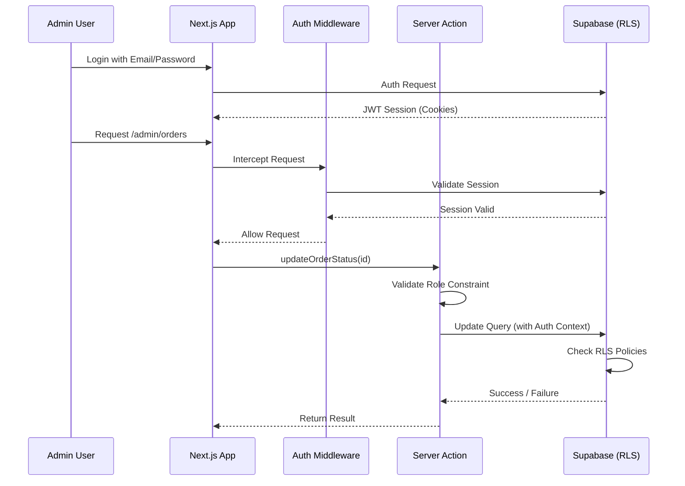

# توثيق الأمان والصلاحيات — مشروع بيت المندي

## 1. نموذج الأمان المعماري (Security Model)

يتبع مشروع بيت المندي مبدأ "الدفاع في العمق" (Defense in Depth) باستخدام عدة مستويات أمنية:
1. **Middlewares (Edge Security):** لحماية المسارات على مستوى الخادم.
2. **Server Actions (Application Security):** عمليات المصادقة المضمنة داخل الكود.
3. **RLS Policies (Database Security):** أمان على مستوى صفوف قاعدة البيانات (PostgreSQL).
4. **Permissions System (Role-Based Access):** الصلاحيات المتدرجة (RBAC).

---

## 2. المصادقة والجلسات (Authentication & Sessions)

- **المزود:** يعتمد على **Supabase Auth**.
- **الجلسات:** يتم إرسال JWT في الـ Cookies الآمنة (`HttpOnly, Secure`).
- **Middleware:** ملف `middleware.ts` في جذر المشروع يقوم بتحديث الجلسة وفحص المسارات المحمية (`/admin`, `/api/admin`, `/api/reports`).

---

## 3. الصلاحيات المتدرجة (Role-Based Access Control)

يتم تقسيم المديرين إلى عدة أدوار داخل النظام (مُعرّفة في `admin_role` Enum):

| الدور (Role) | الوصف | الصلاحيات |
|--------------|-------|-----------|
| `developer` | المطور الرئيسي | وصول كامل 100% وإمكانية إضافة مديرين وتعديل إعدادات النظام وتعديل الأكواد |
| `manager` | مدير المطعم | وصول كامل لجميع العمليات (عدا إدارة المطورين) |
| `admin` | المشرف العام | إدارة الأقسام والطلبات، بدون الوصول لإعدادات حساسة. |
| `order_manager`| مدير الطلبات | مخصص حصرياً لصفحة `/admin/orders` واستلام وتغيير حالات الطلب. |

**آلية التحقق:** 
يتم فحص الصلاحيات عبر مكتبة `lib/permissions.ts` في جانب العميل والخادم، بالإضافة إلى دوال قاعدة البيانات المساعدة (`is_admin()`, `get_admin_role()`).

---

## 4. أمان قاعدة البيانات (Row Level Security - RLS)

جميع الجداول ممكّن عليها RLS (`ENABLE ROW LEVEL SECURITY`). 

### سياسات القراءة (SELECT):
- **الجمهور (Public):** يمكنهم قراءة التصنيفات (`categories`)، الأطباق (`items`)، الأسعار (`item_prices`)، العروض (`offers`)، والمراجعات المعروضة.
- **العملاء:** يمكنهم قراءة طلباتهم فقط عبر `auth.uid() = customer_id`.
- **الإدارة:** الإدارة لديهم صلاحية قراءة كل شيء باستخدام دالة `is_admin()`.

### سياسات الكتابة (INSERT/UPDATE/DELETE):
- **الجمهور:** يمكنهم تسجيل التقييمات وإنشاء الجلسات المؤقتة، وإنشاء طلب إذا كان `customer_id` مساوياً لحسابهم أو `NULL` (للزوار).
- **الإدارة:** العمليات التشغيلية (المنتجات، العروض، الإعدادات) محصورة بالأدوار `developer` و `manager`.
- **مدير الطلبات:** صلاحيته محصورة في تحديث حالة الطلبات (`UPDATE` على `orders` و `INSERT` في `order_status_history`).

### القيود الخاصة (Hard Deletes Prevention):
هناك قاعدة (Rule) لمنع الحذف الفعلي للطلبات لضمان النزاهة المالية:
`CREATE RULE prevent_orders_delete AS ON DELETE TO orders DO INSTEAD NOTHING;`

---

## 5. سجلات التدقيق (Audit Logs)

تُسجّل أي حركة مفصلية داخل النظام (تعديل الطلب، إلغاء الطلب، تغيير الحالات، وتغيير الإعدادات) في جدول `audit_logs`.
- يحتوي الجدول على: المشرف الذي قام بالعملية، نوع العملية، تفاصيل التغيير، والكيان المعدل.
- هذا السجل يتيح المساءلة التامة (Accountability).

---

## 6. تأمين Server Actions

كل دوال الخادم الموجودة في مجلد `src/actions` تقوم بـ:
1. إنشاء `createClient()` لفحص جلسة المستدعي.
2. استخدام محرك الأسعار المركزي الموجود في `lib/pricing-engine.ts` وحساب الأسعار على الخادم حصرياً (Sever-Side Calculation)، مما يمنع التلاعب بالأسعار من طرف العميل (Client-Side Tampering).
3. تغليف عمليات الإنشاء المعقدة بـ Drizzle `transaction()` لضمان "إما نجاح العملية بالكامل أو إلغاؤها".

---

## 7. مخطط تدفق مصادقة الإدارة (Admin Authorization Flow)

